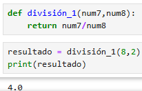

<h2>Función División</h2>

<h4> Definir una función que devuelva la división de los dos números que se pasan como parámetro.</h4> 

 

Definimos una función con el nombre **división_1**, y establecemos 2 parámetros **(num7, num8)**. 

- `def división_1(num7,num8):`

Realizamos la división de **num7 / num8**. La palabra **return** significa que devolvemos el resultado, no solo lo calculamos, sino que además lo entregamos al programa para que pueda usarlo más adelante. 

- `return num7 * num8`

Llamamos a la función **división_1** con los números **8** y **2**. Pasamos el número 2 como **num7**`y el número 3 como **num8**. La función **divide 8 / 2**, lo que da **4**, y devuelve ese resultado. El número 4 se guarda en la variable resultado. 

- `resultado = división_1(8, 2)`

Finalmente imprimimos el resultado.
- `print(resultado)`
 

  

