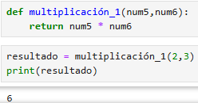

<h2>Función Multiplicación</h2>

<h4> Definir una función que devuelva la multiplicación de los dos números que se pasan como parámetro.</h4> 

 

Definimos una función con el nombre **multiplicación_1**, y establecemos 2 parámetros **(num5, num6)**. 

- `def multiplicación_1(num5,num6):`

Realizamos la multiplicación de **num5 x num6**. La palabra **return** significa que devolvemos el resultado, no solo lo calculamos, sino que además lo entregamos al programa para que pueda usarlo más adelante. 

- `return num5 * num6`

Llamamos a la función **multiplicación_1** con los números **2** y **3**. Pasamos el número 2 como **num5**`y el número 3 como **num6**. La función **multiplica 2 x 3**, lo que da **6**, y devuelve ese resultado. El número 6 se guarda en la variable resultado. 

- `resultado = multiplicación_1(2, 3)`

Finalmente imprimimos el resultado.
- `print(resultado)`
 

  

