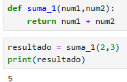

<h2>Función Suma</h2>

<h4> Definir una función que devuelva la suma de los dos números que se pasan como parámetro.</h4>

 

Definimos una función con el nombre **suma_1**, y establecemos 2 parámetros **(num1, num2)**. 

- `def suma_1(num1,num2):`

Realizamos la **suma** de **num1 + num2**. La palabra **return** significa que devolvemos el resultado, no solo lo calculamos, sino que además lo entregamos al programa para que pueda usarlo más adelante. 

- `return num1 + num2`

Llamamos a la función **suma_1** con los números **2** y **3**. Pasamos el número 2 como **num1**y el número 3 como **num2**. La función **suma 2 + 3**, lo que da **5**, y devuelve ese resultado. El número 5 se guarda en la variable resultado. 

- `resultado = suma_1(2, 3)`

Finalmente imprimimos el resultado.
- `print(resultado)`
 

  

